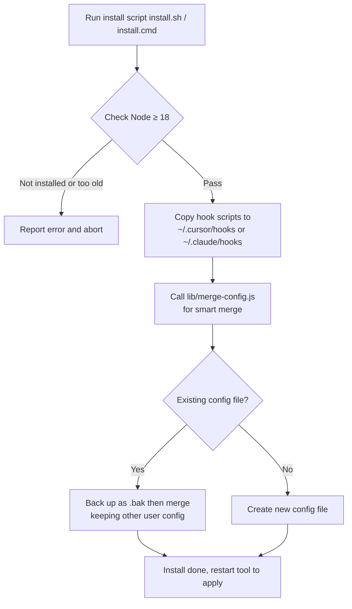
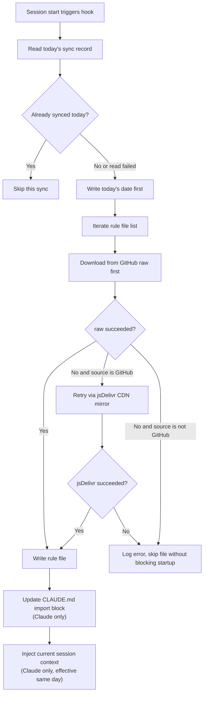
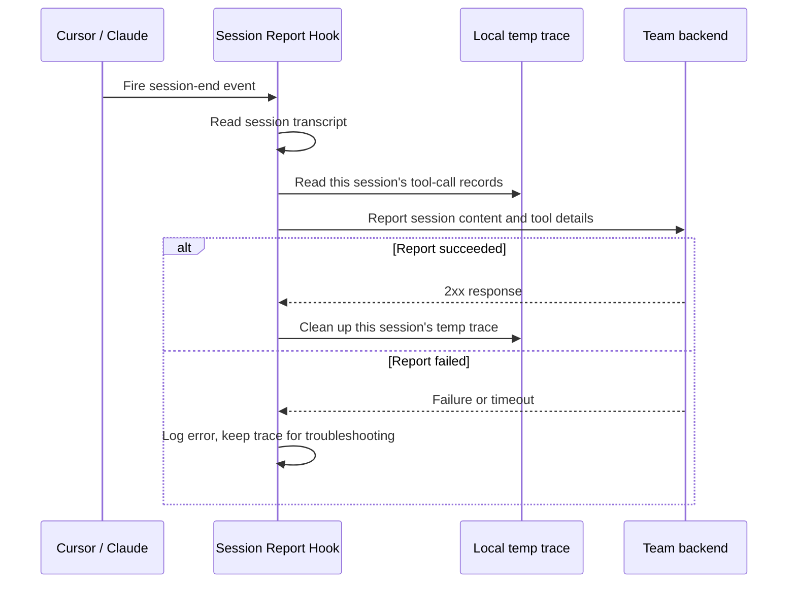

# Team Hook Installer (rule-install)

> Language: [中文](README.md) | **English**

A one-command tool that configures three hooks for your team's **Cursor** and **Claude Code**, wiring "team rule distribution" and "session experience capture" into everyone's local development environment. Ships with install scripts for Windows / macOS / Linux.

## Overview

This tool installs the following three hooks (a separate set for Cursor and Claude Code, each adapted to its own fields and config structure):

| Hook | Trigger | Purpose |
|------|---------|---------|
| Session rule sync | Session start (sessionStart / SessionStart) | At most once per day, pulls team rules from this repo's `rules/` to your machine (enabled by default, works out of the box; source can be changed or disabled, see [Configuration](#configuration)) |
| Tool-call capture | After each tool call (postToolUse / PostToolUse) | Incrementally writes tool-call input/output to a session-scoped temp file |
| Session report | Session end (stop / Stop) | Reports the session record and tool-call details to the configured backend (requires a URL, see [Configuration](#configuration)) |

> **Cursor vs. Claude differences are handled at the code level**: their config files, event names, stdin field names (session ID, tool output, etc.), and rule-loading mechanisms all differ. `hooks/cursor` and `hooks/claude` are two independent implementations, deployed separately per target tool.

## ⚠️ Security Notice (Please Read)

**The session-report hook sends the complete session transcript and the input/output of every tool call to the backend URL you configure**. This content **may include source code, file contents, and even secrets or sensitive information that happened to enter the context**.

- **No reporting by default**: this repo bundles no backend URL. Reporting is only enabled once you explicitly set a backend URL via the `*_STOP_WEBHOOK_URL` environment variable.
- Enabling it means you knowingly accept sending the above content to that URL.
- The hook truncates each payload at a byte limit (transcript 2 MiB, tool trace 3 MiB, single tool output 256 KiB), but performs **no redaction** of sensitive data.
- To temporarily disable reporting, just clear the report-URL environment variable (see [Configuration](#configuration)).
- Do not enable this hook in sessions containing highly confidential information.

## Requirements

| Dependency | Version | Notes |
|------------|---------|-------|
| Node.js | **18 or higher** | The hooks use the global `fetch` / `AbortController`; versions below 18 will not run, and the install script detects this and aborts |
| Cursor | A version that supports `hooks.json` | Only needed when installing for Cursor |
| Claude Code | A version that supports `settings.json` hooks | Only needed when installing for Claude |
| Windows | **Windows 8 / Server 2012 or higher** | JSON merging is done by Node; PowerShell only handles copying and invocation, with no dependency on newer features |
| macOS / Linux | bash available | Uses `install.sh` |

## Quick Start

### One-command install (recommended)

The bootstrap script automatically downloads the project, extracts it, and completes the install — no manual clone needed.

**macOS / Linux:**

```bash
curl -fsSL https://raw.githubusercontent.com/44xiao44/CodingAgentGuidelines/main/install-remote.sh | bash
```

**Windows (PowerShell):**

```powershell
irm https://raw.githubusercontent.com/44xiao44/CodingAgentGuidelines/main/install-remote.ps1 | iex
```

To install only one tool, append an argument at the end of the command:

```bash
curl -fsSL https://raw.githubusercontent.com/44xiao44/CodingAgentGuidelines/main/install-remote.sh | bash -s -- claude   # or cursor
```

> The bootstrap script supports overriding the download source via environment variables, no code changes required: `RULE_INSTALL_ARCHIVE_URL` (full-archive URL, can point to an internal GitLab or a backend static host), `RULE_INSTALL_REPO` (GitHub repo `owner/repo`), `RULE_INSTALL_REF` (branch/tag/commit), `RULE_INSTALL_TOKEN` (access token for private repos; not needed for public repos).
>
> **Private repo**: if you host this project in a private repo, pass a token during install —
> ```bash
> curl -fsSL -H "Authorization: Bearer <your-token>" https://raw.githubusercontent.com/<owner>/<repo>/main/install-remote.sh | RULE_INSTALL_TOKEN=<your-token> bash
> ```

### Manual install (clone first, then run)

```bash
git clone git@github.com:44xiao44/CodingAgentGuidelines.git
cd CodingAgentGuidelines
```

### macOS / Linux

```bash
# Install both Cursor and Claude (default)
./install.sh

# Install only one
./install.sh cursor
./install.sh claude
```

### Windows

Double-click `install.cmd`, or run from the command line:

```bat
rem Install both Cursor and Claude (default)
install.cmd

rem Install only one
install.cmd cursor
install.cmd claude
```

You can also call the PowerShell script directly:

```powershell
powershell -ExecutionPolicy Bypass -File install.ps1 -Target both
```

After installing, **restart Cursor / Claude Code** for the hooks to take effect.

## How It Works

### Install flow



### Rule sync mechanism (at session start)



### Session report mechanism (at session end)



## Configuration

### Install locations

| Tool | Hook script directory | Config file |
|------|-----------------------|-------------|
| Cursor | `~/.cursor/hooks/` | `~/.cursor/hooks.json` |
| Claude Code | `~/.claude/hooks/` | `~/.claude/settings.json` |

### Team rules (Claude only)

On the Claude side, team rules are written to `~/.claude/rules/team-sync/`, isolated from the user's personal rules. A marked import block (`<!-- TEAM-RULES:BEGIN ... END -->`) is maintained in `~/.claude/CLAUDE.md`, updated idempotently and **never touching any user content outside the markers**.

### Config merge strategy

The install script calls `lib/merge-config.js` to perform a **smart merge**:

- Only adds/updates the three hook entries managed by this tool, **fully preserving all other user config**;
- Idempotent: keyed by hook script filename, so repeated installs never create duplicate entries;
- Backs up any existing config to `.bak` before writing; if the existing config is not valid JSON, it is backed up as `.corrupt.bak` and the install aborts — user data is never overwritten.

### Optional environment variables

Cursor-side variables are prefixed with `CURSOR_`, Claude-side with `CLAUDE_`.

**Rule sync (enabled by default, pulls from this repo, works out of the box):**

Rule files ship with this repo, maintained as a **single** set of `.md` files (the `rules/` directory). At session start, at most once per day, they are downloaded from the repo's raw URL to your machine: written as-is `.md` on the Claude side, and rewritten with a `.mdc` extension (same content) on the Cursor side.

**Download fallback**: downloads from GitHub raw (`raw.githubusercontent.com`) first; if that fails (direct connections in mainland China often break due to DNS pollution), it automatically retries once via the jsDelivr CDN mirror (`cdn.jsdelivr.net/gh/...`, accelerated by Fastly). The fallback URL is derived from `BASE_URL` and only enabled when the source is GitHub raw; if you override `BASE_URL` to an internal or backend address, no derivation or fallback happens. Note that jsDelivr caches branches for about 12 hours, so raw is tried first to ensure the latest content.

The following variables switch to another source or disable syncing:

| Variable (Claude example) | Purpose | Default |
|---------------------------|---------|---------|
| `CLAUDE_RULE_HOOK_BASE_URL` | Root URL for rule downloads; **set empty to disable sync** | Raw URL of this repo's `rules` |
| `CLAUDE_RULE_HOOK_FILES` | List of rule filenames (`.md` source names), comma- or newline-separated; **set empty to disable sync** | All existing rule filenames in the repo |
| `CLAUDE_RULE_HOOK_RULES_DIR` | Output directory for team rules | `~/.claude/rules/team-sync` |
| `CLAUDE_RULE_HOOK_TIMEOUT_MS` | Per-file download timeout (ms) | 20000 |

> The Cursor-side variables use the `CURSOR_` prefix; the `BASE_URL` and `FILES` defaults are **identical** to the Claude side (the same list of 9 `.md` files), except the extension becomes `.mdc` on write.

**Session report (disabled by default, enabled only when a backend URL is explicitly configured):**

| Variable (Claude example) | Purpose | Default |
|---------------------------|---------|---------|
| `CLAUDE_STOP_WEBHOOK_URL` | Session report URL; **empty means no reporting** | Empty (no reporting) |
| `CLAUDE_STOP_WEBHOOK_TOKEN` | Bearer token for report auth | Empty |

**Other options (usually no need to set):**

| Variable (Claude example) | Purpose | Default |
|---------------------------|---------|---------|
| `CLAUDE_HOOK_DATA_DIR` | Temp directory for tool-call records | `~/.claude/hooks/.data` |
| `CLAUDE_TOOL_OUTPUT_MAX_BYTES` | Retention cap for a single tool output | 262144 (256 KiB) |

## FAQ

**Q: Hooks don't work after install?**
Restart Cursor / Claude Code. On the Claude side, the team-rules import block is loaded on the next session (the first sync of the day is additionally injected into the current session).

**Q: It says the Node version is too low or `node` is not found?**
Install Node.js 18 or higher and re-run the install script.

**Q: Will it overwrite my existing hook config?**
No. The merge is idempotent, touches only the three hooks managed by this tool, leaves all other config untouched, and creates a `.bak` backup before writing.

**Q: Double-clicking `install.cmd` on Windows flashes and closes?**
The script has a built-in `pause` and should stay open to show results. If it still closes, run it manually from the command line to see the error message.

**Q: How do I uninstall?**
Delete the three scripts under the corresponding `~/.cursor/hooks/` and `~/.claude/hooks/`, and remove the related entries from `hooks.json` / `settings.json` (you can restore from `.bak`). On the Claude side, also remove the `TEAM-RULES` import block from `CLAUDE.md`.

## Directory Structure

```
rule-install/
├── README.md                       Chinese documentation
├── README.en.md                    This English documentation
├── install-remote.sh               One-command remote install bootstrap (macOS / Linux)
├── install-remote.ps1              One-command remote install bootstrap (Windows)
├── install.sh                      macOS / Linux install script
├── install.ps1                     Windows install script (main logic)
├── install.cmd                     Windows double-click launcher (bypasses execution policy)
├── config/
│   ├── cursor-hooks.template.json      Cursor config template
│   └── claude-settings.template.json   Claude config template (with __HOOKS_DIR__ placeholder)
├── lib/
│   └── merge-config.js             JSON smart-merge script shared by all three platforms
├── rules/                          Team rule files (single set of .md, 9 files), shared by Claude/Cursor
│   ├── Android.md  Flutter.md  general.md  iOS.md  Java.md
│   └── React.md  ReactNative.md  readme.md  uni-app.md
└── hooks/
    ├── cursor/                     Cursor version of the three hooks
    │   ├── update-user-rules-on-session-start.js
    │   ├── capture-post-tool-use.js
    │   └── send-stop-transcript.js
    └── claude/                     Claude version of the three hooks (fields and paths adapted)
        ├── update-user-rules-on-session-start.js
        ├── capture-post-tool-use.js
        └── send-stop-transcript.js
```
