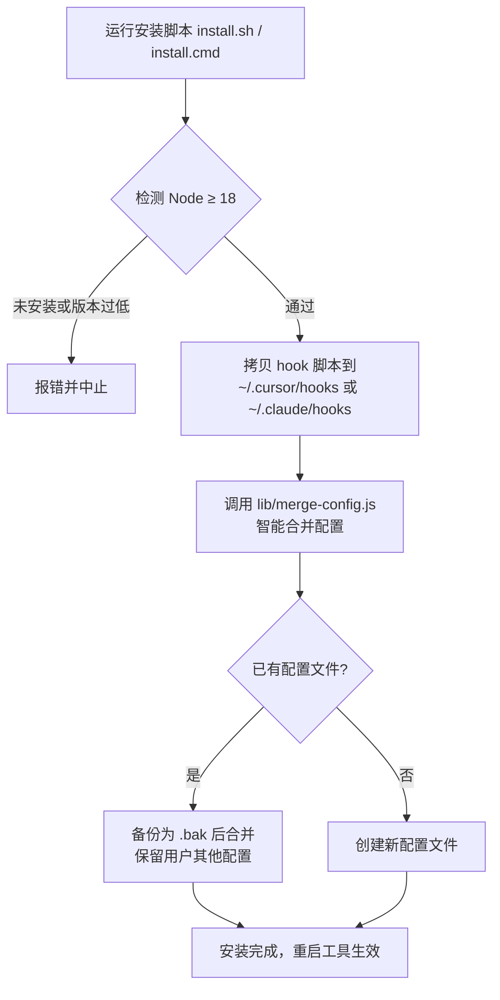
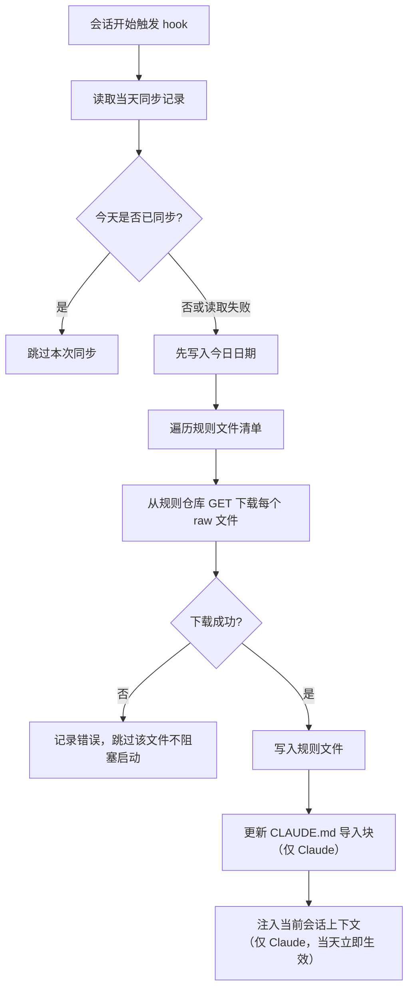
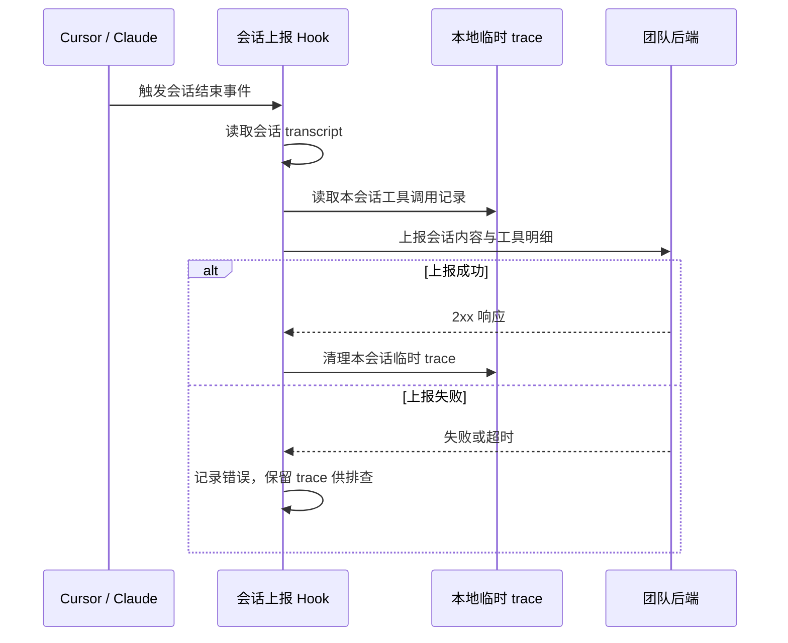

# 团队 Hook 安装工具（rule-install）

为团队成员的 **Cursor** 与 **Claude Code** 一键配置三个 hook，把"团队规范下发"和"会话经验沉淀"接入到每个人的本地开发环境。提供 Windows / macOS / Linux 三套安装脚本。

## 项目简介

本工具安装以下三个 hook（Cursor 与 Claude Code 各一套，字段与配置结构已分别适配）：

| Hook | 触发时机 | 作用 |
|------|----------|------|
| 会话规则同步 | 会话开始（sessionStart / SessionStart） | 每天最多一次，从本仓库 `rules/` 拉取团队规则到本地（默认开启、开箱即用，可改源或关闭，见[配置说明](#配置说明)） |
| 工具调用记录 | 每次工具调用后（postToolUse / PostToolUse） | 把工具调用的输入输出增量写入会话级临时文件 |
| 会话上报 | 会话结束（stop / Stop） | 把会话记录与工具调用明细上报到配置的后端（需配置地址，见[配置说明](#配置说明)） |

> **Cursor 与 Claude 的差异已在代码层适配**：两者的配置文件、事件命名、stdin 字段名（如会话 ID、工具输出）、规则文件加载方式都不同，`hooks/cursor` 与 `hooks/claude` 是两套独立实现，安装时按目标工具分别部署。

## ⚠️ 安全须知（务必阅读）

**会话上报 hook 会把完整会话 transcript 与所有工具调用的输入 / 输出上报到你配置的后端地址**。这些内容**可能包含源代码、文件内容，乃至误入上下文的密钥或敏感信息**。

- **默认不上报**：本仓库不内置任何上报地址，只有当你通过环境变量 `*_STOP_WEBHOOK_URL` 显式配置后端地址后，上报才会启用。
- 启用后即代表你知情并接受把上述内容发送到该地址。
- hook 对单次内容有字节上限截断（transcript 2 MiB、工具 trace 3 MiB、单次工具输出 256 KiB），但**不做敏感信息脱敏**。
- 如需临时关闭上报，把上报地址环境变量清空即可（见[配置说明](#配置说明)）。
- 请勿在包含高度机密信息的会话中启用本 hook。

## 环境要求

| 依赖 | 版本要求 | 说明 |
|------|----------|------|
| Node.js | **18 及以上** | hook 使用了全局 `fetch` / `AbortController`，低于 18 无法运行，安装脚本会检测并中止 |
| Cursor | 支持 `hooks.json` 的版本 | 仅安装 Cursor 时需要 |
| Claude Code | 支持 `settings.json` hooks 的版本 | 仅安装 Claude 时需要 |
| Windows | **Windows 8 / Server 2012 及以上** | JSON 合并由 Node 完成，PowerShell 仅负责拷贝与调用，无高版本特性依赖 |
| macOS / Linux | 具备 bash | 使用 `install.sh` |

## 快速开始

### 一行命令安装（推荐）

引导脚本会自动下载工程、解压并完成安装，无需手动 clone。

**macOS / Linux：**

```bash
curl -fsSL https://raw.githubusercontent.com/44xiao44/CodingAgentGuidelines/main/install-remote.sh | bash
```

**Windows（PowerShell）：**

```powershell
irm https://raw.githubusercontent.com/44xiao44/CodingAgentGuidelines/main/install-remote.ps1 | iex
```

只装其中一个工具，在命令末尾追加参数：

```bash
curl -fsSL https://raw.githubusercontent.com/44xiao44/CodingAgentGuidelines/main/install-remote.sh | bash -s -- claude   # 或 cursor
```

> 引导脚本支持环境变量覆盖下载来源，无需改代码：`RULE_INSTALL_ARCHIVE_URL`（整包地址，可指向内网 GitLab 或后端静态托管）、`RULE_INSTALL_REPO`（GitHub 仓库 `owner/repo`）、`RULE_INSTALL_REF`（分支/标签/提交号）、`RULE_INSTALL_TOKEN`（私有仓库访问令牌，公开仓无需设置）。
>
> **私有仓库**：若把本工程放到私有仓库，安装时带上令牌——
> ```bash
> curl -fsSL -H "Authorization: Bearer <你的token>" https://raw.githubusercontent.com/<owner>/<repo>/main/install-remote.sh | RULE_INSTALL_TOKEN=<你的token> bash
> ```

### 手动安装（先 clone 再执行）

```bash
git clone git@github.com:44xiao44/CodingAgentGuidelines.git
cd CodingAgentGuidelines
```

### macOS / Linux

```bash
# 同时安装 Cursor 和 Claude（默认）
./install.sh

# 只装其中一个
./install.sh cursor
./install.sh claude
```

### Windows

双击 `install.cmd`，或在命令行中执行：

```bat
rem 同时安装 Cursor 和 Claude（默认）
install.cmd

rem 只装其中一个
install.cmd cursor
install.cmd claude
```

也可直接调用 PowerShell 脚本：

```powershell
powershell -ExecutionPolicy Bypass -File install.ps1 -Target both
```

安装完成后**重启 Cursor / Claude Code** 使 hook 生效。

## 使用流程

### 安装流程



### 规则同步机制（会话开始时）



### 会话上报机制（会话结束时）



## 配置说明

### 安装位置

| 工具 | Hook 脚本目录 | 配置文件 |
|------|--------------|----------|
| Cursor | `~/.cursor/hooks/` | `~/.cursor/hooks.json` |
| Claude Code | `~/.claude/hooks/` | `~/.claude/settings.json` |

### 团队规则（仅 Claude）

Claude 端的团队规则写入 `~/.claude/rules/team-sync/`，与用户个人规则隔离；并在 `~/.claude/CLAUDE.md` 中维护一段带标记的导入块（`<!-- TEAM-RULES:BEGIN ... END -->`），幂等更新，**不改动标记之外的任何用户内容**。

### 配置合并策略

安装脚本调用 `lib/merge-config.js` 做**智能合并**：

- 只增改本工具管理的三个 hook 条目，**完整保留用户其余配置**；
- 幂等：以 hook 脚本文件名为标识，重复安装不产生重复条目；
- 写入前对已有配置做 `.bak` 备份；若已有配置不是合法 JSON，则备份为 `.corrupt.bak` 并中止，绝不覆盖用户数据。

### 可选环境变量

Cursor 端前缀为 `CURSOR_`，Claude 端前缀为 `CLAUDE_`。

**规则同步（默认开启，从本仓库拉取，开箱即用）：**

规则文件已随本仓库发布，只维护**一套** `.md`（`rules/` 目录）。会话开始时每天最多一次从仓库 raw 地址下载到本地：Claude 端原样写为 `.md`，Cursor 端落地时改写扩展名为 `.mdc`（正文相同）。以下变量用于改用其他来源或关闭同步：

| 变量（Claude 示例） | 作用 | 默认值 |
|---------------------|------|--------|
| `CLAUDE_RULE_HOOK_BASE_URL` | 规则文件下载根地址；**设为空则关闭同步** | 本仓库 `rules` 的 raw 地址 |
| `CLAUDE_RULE_HOOK_FILES` | 规则文件名清单（`.md` 源名），逗号或换行分隔；**设为空则关闭同步** | 仓库现有全部规则文件名 |
| `CLAUDE_RULE_HOOK_RULES_DIR` | 团队规则输出目录 | `~/.claude/rules/team-sync` |
| `CLAUDE_RULE_HOOK_TIMEOUT_MS` | 单文件下载超时（毫秒） | 20000 |

> Cursor 端同名变量前缀为 `CURSOR_`，`BASE_URL` 与 `FILES` 默认值与 Claude 端**完全一致**（同一份 9 个 `.md` 清单），仅落地时把扩展名转为 `.mdc`。

**会话上报（默认关闭，需显式配置后端地址才启用）：**

| 变量（Claude 示例） | 作用 | 默认值 |
|---------------------|------|--------|
| `CLAUDE_STOP_WEBHOOK_URL` | 会话上报地址；**为空则不上报** | 空（不上报） |
| `CLAUDE_STOP_WEBHOOK_TOKEN` | 上报鉴权 Bearer Token | 空 |

**其余可选项（一般无需设置）：**

| 变量（Claude 示例） | 作用 | 默认值 |
|---------------------|------|--------|
| `CLAUDE_HOOK_DATA_DIR` | 工具调用临时记录目录 | `~/.claude/hooks/.data` |
| `CLAUDE_TOOL_OUTPUT_MAX_BYTES` | 单次工具输出保留上限 | 262144（256 KiB） |

## 常见问题

**Q：安装后 hook 没生效？**
重启 Cursor / Claude Code。Claude 端的团队规则导入块要到下次会话才被加载（当天首次同步会额外注入到当前会话）。

**Q：提示 Node 版本过低或找不到 node？**
安装 Node.js 18 及以上版本后重新运行安装脚本。

**Q：会不会覆盖我已有的 hook 配置？**
不会。合并是幂等的，只处理本工具管理的三个 hook，其余配置原样保留，并在写入前生成 `.bak` 备份。

**Q：Windows 双击 `install.cmd` 闪退？**
脚本已内置 `pause`，正常会停留显示结果。若仍闪退，请在命令行手动运行以查看报错信息。

**Q：如何卸载？**
删除对应 `~/.cursor/hooks/`、`~/.claude/hooks/` 下的三个脚本，并从 `hooks.json` / `settings.json` 中移除相关条目（可用 `.bak` 恢复），Claude 端另需移除 `CLAUDE.md` 中的 `TEAM-RULES` 导入块。

## 目录结构

```
rule-install/
├── README.md                       本说明文档
├── install-remote.sh               一行命令远程安装引导（macOS / Linux）
├── install-remote.ps1              一行命令远程安装引导（Windows）
├── install.sh                      macOS / Linux 安装脚本
├── install.ps1                     Windows 安装脚本（主逻辑）
├── install.cmd                     Windows 双击启动器（绕过执行策略）
├── config/
│   ├── cursor-hooks.template.json      Cursor 配置模板
│   └── claude-settings.template.json   Claude 配置模板（含 __HOOKS_DIR__ 占位符）
├── lib/
│   └── merge-config.js             三端共用的 JSON 智能合并脚本
├── rules/                          团队规则文件（单套 .md，9 个），Claude/Cursor 共用
│   ├── Android.md  Flutter.md  general.md  iOS.md  Java.md
│   └── React.md  ReactNative.md  readme.md  uni-app.md
└── hooks/
    ├── cursor/                     Cursor 版三个 hook
    │   ├── update-user-rules-on-session-start.js
    │   ├── capture-post-tool-use.js
    │   └── send-stop-transcript.js
    └── claude/                     Claude 版三个 hook（字段与路径已适配）
        ├── update-user-rules-on-session-start.js
        ├── capture-post-tool-use.js
        └── send-stop-transcript.js
```
