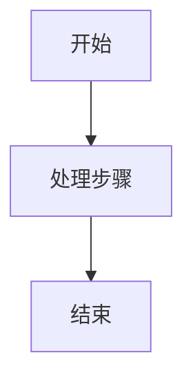

# README 输出规范

> 适用于所有 README 文档生成与改写场景，包括工程根目录 README 与任意子目录 README。

## 一、适用范围

- 当用户要求生成、改写、补充、整理 README 时，必须遵循本规范。
- 路径包括但不限于：项目根目录 `README.md`、子目录 `*/README.md`、模块说明文档。

## 二、语言要求（强制）

- README 正文必须使用中文输出。
- 标题、段落说明、步骤说明、注意事项、图表注释均使用中文。
- 仅以下内容允许保留原文：
  - 命令行命令
  - 文件路径
  - 代码符号（函数名、类名、变量名、配置键等）
  - 协议/标准固定术语（如 HTTP、JSON、YAML）

## 三、格式要求（强制）

- README 必须是标准 Markdown 格式（`.md`）。
- 结构优先使用 Markdown 标题、列表、代码块，不使用纯文本排版替代。
- 当需要表达流程、结构、依赖、时序时，优先使用 Mermaid 图。

## 四、图表输出要求（强制）

- 所有流程图/架构图/时序图必须使用 Mermaid 代码块，格式如下：

- 禁止使用 ASCII 图（如 `A -> B -> C` 的纯文本箭头排版）替代 Mermaid。
- Mermaid 图中的节点名称、分支说明、注释文本必须使用中文。
- 图中的命令、路径可保留原文，但应置于中文语义节点中。

## 五、推荐的 README 章节结构

- 项目简介
- 环境要求
- 快速开始
- 使用流程（优先 Mermaid）
- 配置说明
- 常见问题（可选）
- 目录结构（可选）

## 六、冲突处理优先级

- 若用户对 README 输出格式有明确要求，优先遵循用户要求。
- 在无额外指令时，默认严格执行本规范。

