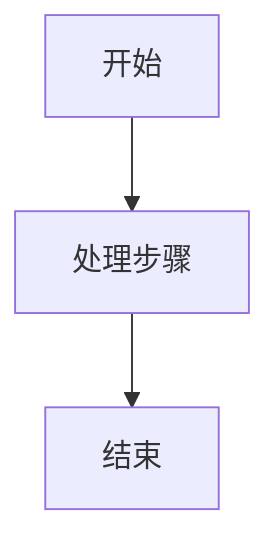

# README 输出规范

> 适用于所有 README 文档生成与改写场景，包括工程根目录 README 与任意子目录 README。

## 一、适用范围

- 当用户要求生成、改写、补充、整理 README 时，必须遵循本规范。
- 路径包括但不限于：项目根目录 `README.md`、子目录 `*/README.md`、模块说明文档。

## 二、双语言输出要求（强制）

- 每次生成 README 时，必须同时输出两份**内容对等**的真实文件：
  - `README.md`：中文版（主文件，仓库默认展示）。
  - `README.en.md`：英文版。
- 两份必须是磁盘上真实存在的独立文件。**禁止**只在一个文件里上下堆叠两种语言，**禁止**只生成其中一份。
- 两份内容必须语义对等：章节结构、Mermaid 图、代码块、配置项一一对应；任一份新增或修改章节时，另一份必须同步更新。
- 子目录 README 同理：`<dir>/README.md`（中文）+ `<dir>/README.en.md`（英文）。
- 两份文件顶部必须提供语言互链，便于切换：
  - 中文版首行：`> 语言：中文 | [English](./README.en.md)`
  - 英文版首行：`> Language: [中文](./README.md) | English`

## 三、语言要求（强制）

- 中文版（`README.md`）：正文、标题、段落说明、步骤说明、注意事项、图表注释全部使用中文。
- 英文版（`README.en.md`）：正文、标题、段落说明、步骤说明、注意事项、图表注释全部使用英文，要求自然地道，不做逐字直译。
- 两份文件中，以下内容均保留原文，不翻译：
  - 命令行命令
  - 文件路径
  - 代码符号（函数名、类名、变量名、配置键等）
  - 协议/标准固定术语（如 HTTP、JSON、YAML）

## 四、格式要求（强制）

- 两份 README 必须都是标准 Markdown 格式（`.md`）。
- 结构优先使用 Markdown 标题、列表、代码块，不使用纯文本排版替代。
- 当需要表达流程、结构、依赖、时序时，优先使用 Mermaid 图。

## 五、图表输出要求（强制）

- 所有流程图/架构图/时序图必须使用 Mermaid 代码块，格式如下：

- 禁止使用 ASCII 图（如 `A -> B -> C` 的纯文本箭头排版）替代 Mermaid。
- Mermaid 图中的节点文本：中文版用中文，英文版用英文；两版图的结构必须完全一致。
- 图中的命令、路径可保留原文，但应置于对应语言的语义节点中。

## 六、推荐的 README 章节结构

- 项目简介
- 环境要求
- 快速开始
- 使用流程（优先 Mermaid）
- 配置说明
- 常见问题（可选）
- 目录结构（可选）

## 七、冲突处理优先级

- 若用户对 README 输出格式（如文件命名、语言、是否双语）有明确要求，优先遵循用户要求。
- 在无额外指令时，默认严格执行本规范（中文 `README.md` + 英文 `README.en.md` 双份）。
